# Windows 环境搭建 TensorFlow 2.1+ GPU 训练模型加速支持

## 写在前面

最近准备尝试跑一跑 TensorFlow GPU 训练模型，平时开发用的 MBP，无赖显卡是 AMD 只支持 CPU 训练，但恰有闲置 Win10 笔记本电脑一台显卡 NVIDIA 支持 CUDA® 。

Tensorflow GPU 训练加速需要支持 CUDA® 的 GPU 显卡，这里提到的 CUDA 指的是，是 NVIDIA 研发的一种并行计算平台和编程模型，它可以通过利用 GPU 的处理能力，可大幅提升计算性能的技术，更多查看[相关内容](https://www.geforce.cn/hardware/technology/cuda/faq)。

 环境搭建过程整体比较简单，查找下载相关工具包需要捣腾一会。

## 1 硬件条件

 首先查看自己的显卡型号是否满足条件，TensorFlow 官方文档[硬件要求](https://tensorflow.google.cn/install/gpu?hl=zh_cn#hardware_requirements)提到了，CUDA® 架构为 3.5、3.7、5.2、6.0、6.1、7.0 或更高的 NVIDIA® GPU 卡。

### 1.1 查看显卡型号

第一步查看自己的显卡型号，进入 NVIDIA 控制面板，点击系统信息。

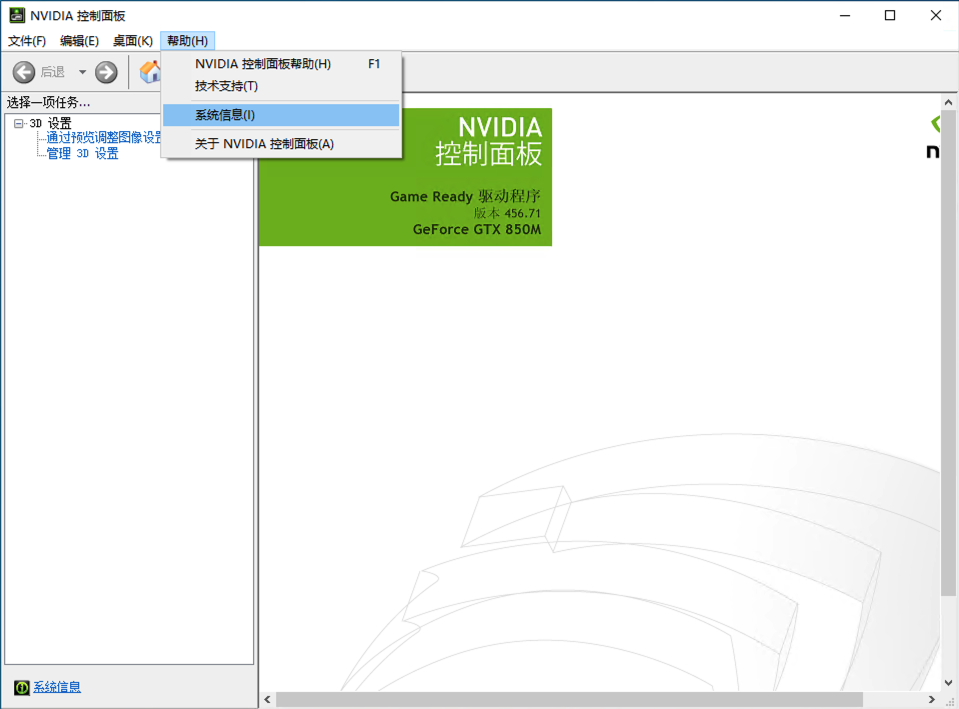


显卡型号为 GeForce GTX 850M，电脑比较老很早前的。


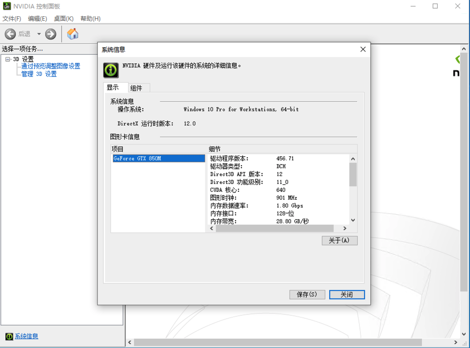


### 1.2 查询显卡是否支持 CUDA®

显卡型号为 [GeForce GTX 850M](http://www.geforce.com/hardware/notebook-gpus/geforce-gtx-850m)，点击查看[支持 CUDA® 的 GPU 卡](https://developer.nvidia.com/cuda-gpus)列表，查看显卡型号是否在支持的列表里面。


计算能力为 5，显卡支持 CUDA ，接下来查看 CUDA 驱动版本，NVIDIA 控制面板，系统信息的组件里面。


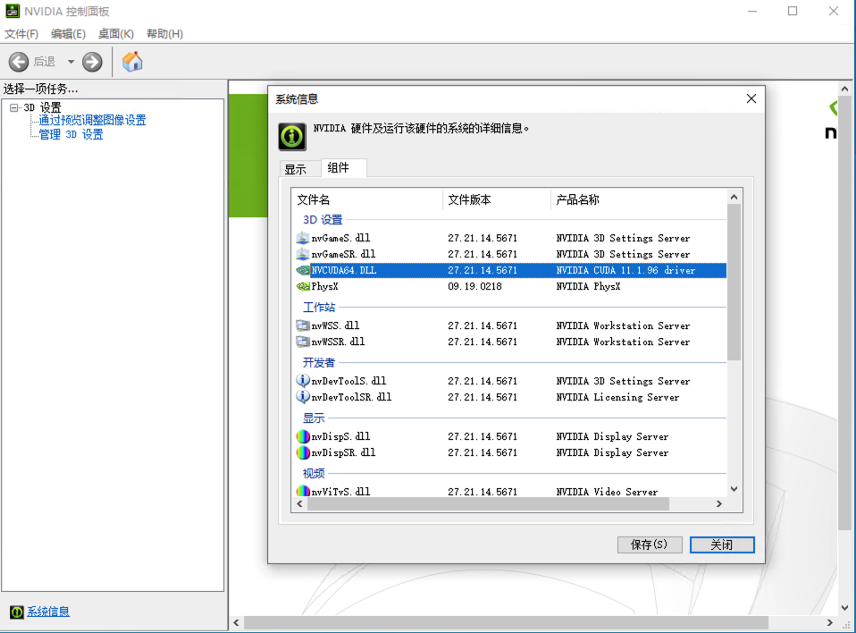


版本为 11.1.96，在 TensorFlow 支持 CUDA 驱动版本范围上，如果版本过低可查看下面提到的软件下载进行安装升级最新驱动。


## 2 软件下载

### 2.1 下载安装 NVIDIA® GPU 驱动程序

输入信息查询显卡驱动，下载安装最新的 [NVIDIA® GPU 驱动程序](https://www.nvidia.com/drivers)，方便后面支持 CUDA Toolkit 安装 10.1 版本，CUDA Toolkit 10.1 需要驱动版本 418.x 或更高版本。


版本号为 456.71，满足要求，然后下载下来后安装驱动。


### 2.2 下载安装 [CUDA® Toolkit](https://developer.nvidia.com/cuda-toolkit-archive) 

CUDA 工具包提供了用于创建高性能GPU加速应用程序的开发环境。TensorFlow（TensorFlow 2.1.0 及更高版本）支持 CUDA® 10.1 的 [CUDA® Toolkit](https://developer.nvidia.com/cuda-toolkit-archive) 。


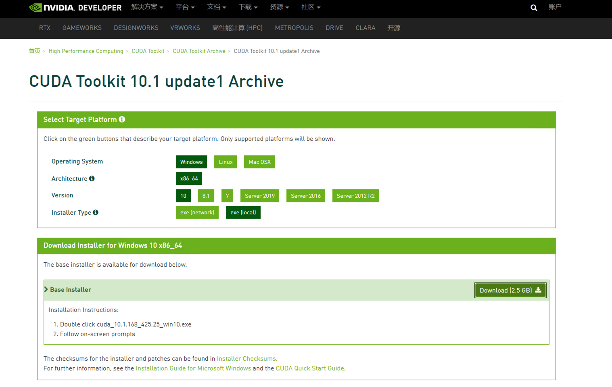

选择临时文件目录，这里选择了默认设置。


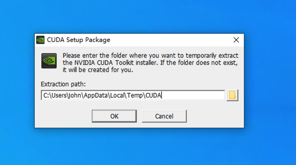


然后一直下一步，直到这里，如果电脑上面没有安装 Visual Studio 会提示你安装 Visual Studio，如果后续有打算从源码构建 Tensorflow，则需要安装，具体安装内容可查看 [在 Windows 环境中从源代码构建](https://tensorflow.google.cn/install/source_windows?hl=zh_cn#install_visual_c_build_tools_2019)。


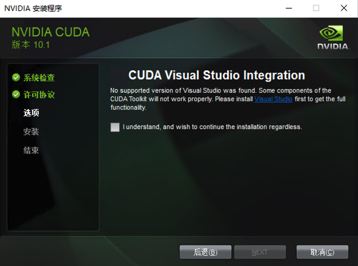


安装完成之后，会自动添加了几个环境变量到系统中，打开终端里面输入 `nvcc -V` 验证安装结果。


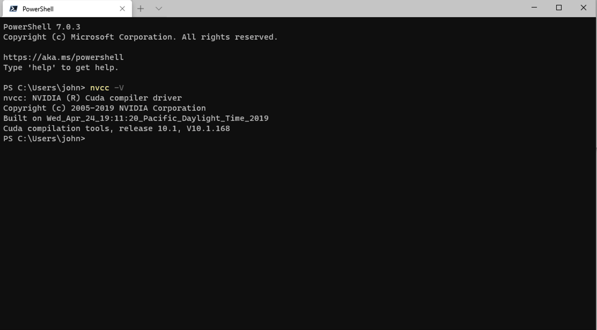


### 2.3 下载 cuDNN SDK 7.6

cuDNN 是一个 GPU 加速的深度神经网络库，下载 cuDNN SDK 需要注册 NVIDIA Developer Program，进入下载页面后选择 CUDA 10.1 的 cuDNN 7.6 版本。


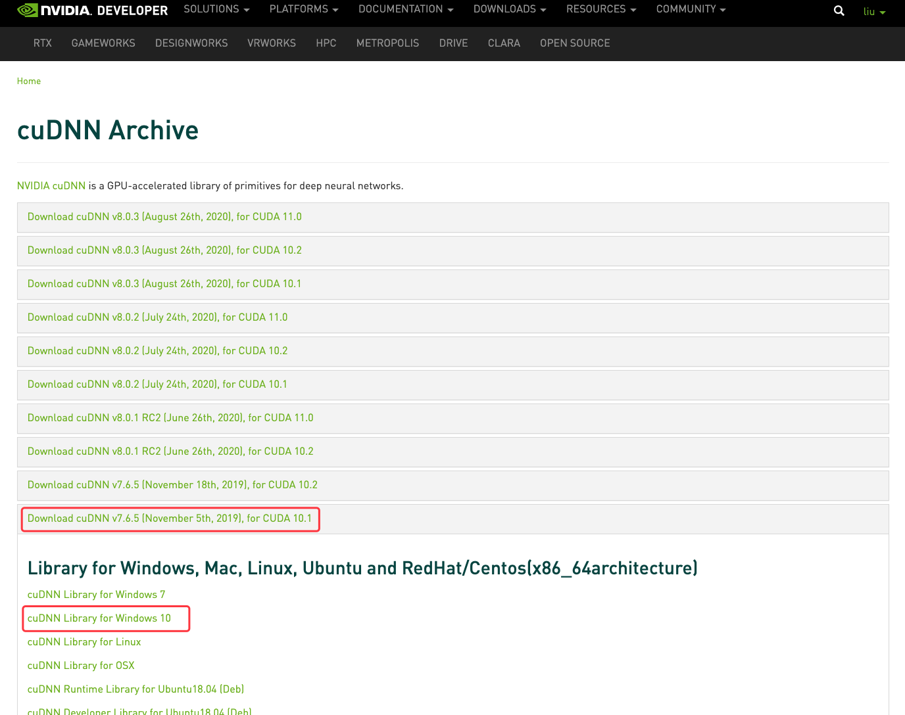


下载成功之后将其压缩包解压，拷贝放到 CUDA 目录 `C:\Program Files\NVIDIA GPU Computing Toolkit\CUDA\v10.1\`下面，这里拷贝是指将这三个目录下面的文件拷贝放入到 CUDA v10.1 对应的目录里面。


### 2.4 [TensorRT 6.0](https://docs.nvidia.com/deeplearning/sdk/tensorrt-install-guide/index.html) （可选）

用于可缩短用某些模型进行推断的延迟时间并提高吞吐量，可选择 [Zip](https://docs.nvidia.com/deeplearning/tensorrt/install-guide/index.html#installing-zip) 方式安装，这里可选安装。


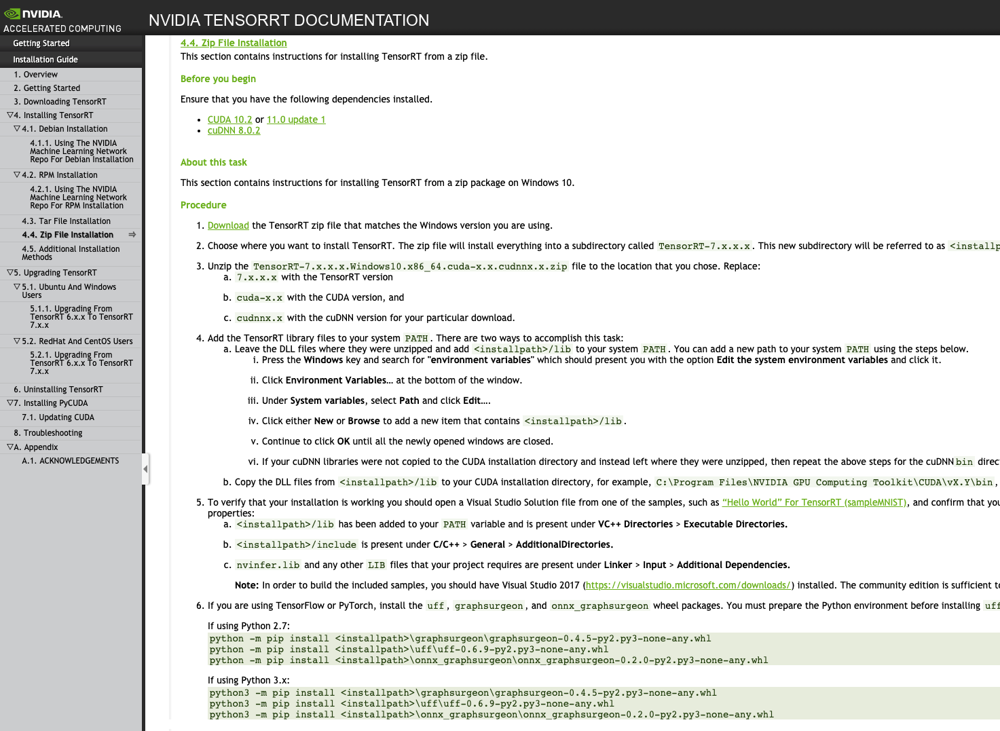


## 3 安装 Anaconda

使用 [Anaconda](https://www.anaconda.com/) 通过方便管理包依赖问题,，如果觉得 Anaconda 占用磁盘空间过大可以使用 [miniconda](https://docs.conda.io/en/latest/miniconda.html)，平时开发电脑上用的 miniconda，关于miniconda 安装使用可点击[这个](https://github.com/liuvigongzuoshi/web-developer-resources/blob/master/python/miniconda.md)。

### 3.1 下载 Anaconda

- 从官网下载：https://www.continuum.io/downloads 官网速度比较慢，不太推荐。
- 从清华镜像下载：https://mirrors.tuna.tsinghua.edu.cn/anaconda/archive/ 

### 3.2 安装 Anaconda

安装过程也笔记简单，需要注意以下两个地方。

Anaconda 安装使用后占有磁盘空间比较大，如果 C 盘空间有限不推荐安装在 C盘。


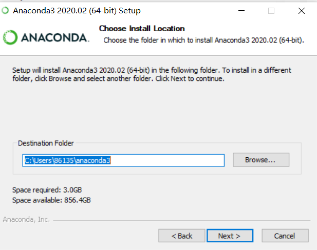


下面有两个选择，第一个是将 Anaconda 添加到环境变量中，如果电脑上之前安装了 Anaconda 的另一个版本软件会影响 Anaconda 的使用，添加到环境变量的好处是可以直接打开终端执行相关命令管理包，如果不添加到环境变量也可以在 windows 的开始菜单里面找到 Anaconda Prompt ，然后在打开的终端上执行相关命令管理包，所以这里可以不添加到系统环境变量。

第二个是将 Anaconda 的 python 3.7 版本设置成我电脑上默认的 python，这样你的 IDE 等编辑器会检测到这个版本，方便后面在 IDE 调试代码的时候可以用到这个版本，如果之前电脑上有装过 python 这里可根据你的情况适当选择。


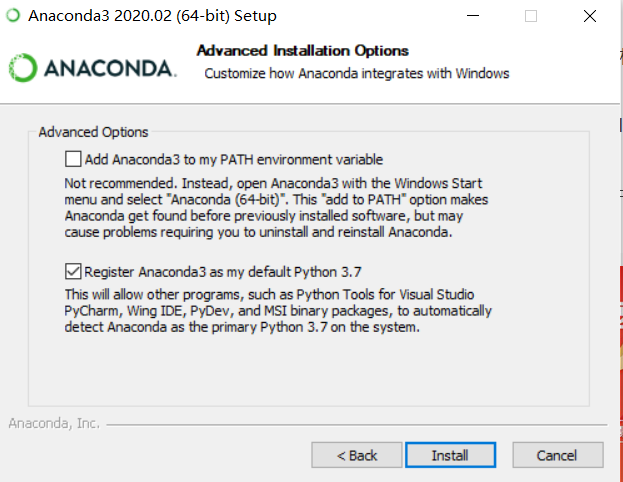


### 3.3 配置 Anaconda

Anaconda 官方的数据包镜像，下载比较缓慢，可以考虑用清华的镜像 https://mirrors.tuna.tsinghua.edu.cn/help/anaconda/

将新的镜像地址配置到 `.condarc` 文件，配置镜像内容可以查看 [Anaconda 清华镜像使用帮助](https://mirrors.tuna.tsinghua.edu.cn/help/anaconda/)。

## 4 测试

### 4.1 安装 TensorFlow

打开安装好的 Anaconda Navigator， 创建用于测试 tensorflow-gpu 虚拟环境。


需要注意的是，如果你用 pip 安装官方发布的 TensorFlow ，可以直接安装 tensorflow 包即可，即 `pip install --upgrade tensorflow`，因为官方对于 TensorFlow 1.x，CPU 和 GPU 软件包是分开的，而 2.x 将其打包在一起的，另外 2.x  GPU  软件包也有发布的，也可以 `pip install --upgrade tensorflow-gpu` 安装 GPU 包。

在使用 conda 安装时， Anaconda Cloud 官方把 TensorFlow 2.x CPU 和 GPU 软件包是拆分了的，应该是为了减小包安装体积。

使用 conda 安装 tensorflow-gpu，在输入拦输入 tensorflow 选择 tensorflow-gpu 点击 Applly 即可。

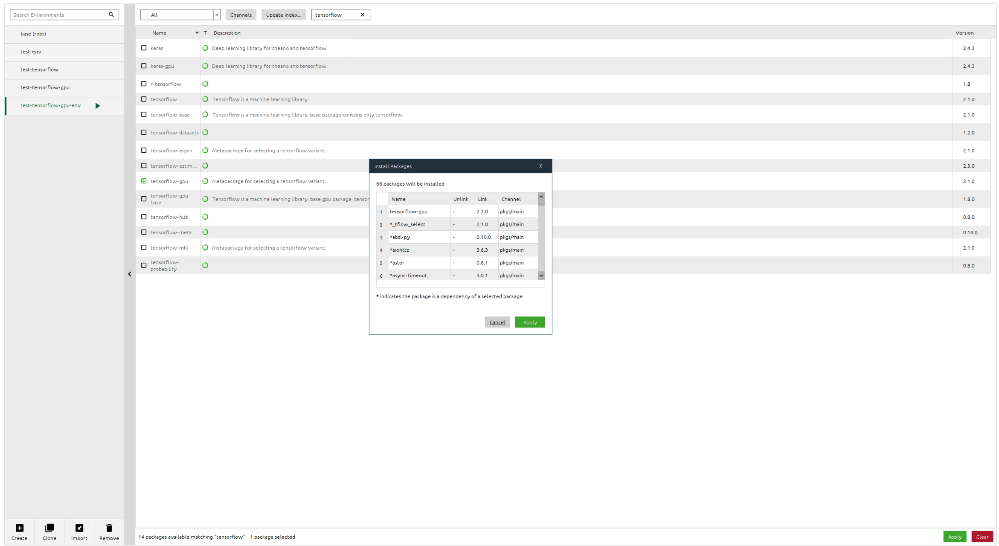


### 4.2 运行代码测试安装结果

打开当前环境的终端或打开 JupytarLab 或者 Notebook 运行以下代码。

```python
import tensorflow as tf
from tensorflow.python.client import device_lib

// 打印已有的 GPU 
print(tf.config.list_physical_devices('GPU'))
// 打印 GPU 设备名称
print(tf.test.gpu_device_name())
// 打印电脑上可以用于计算的设备
print(device_lib.list_local_devices())
```

在 JupytarLab 运行结果为

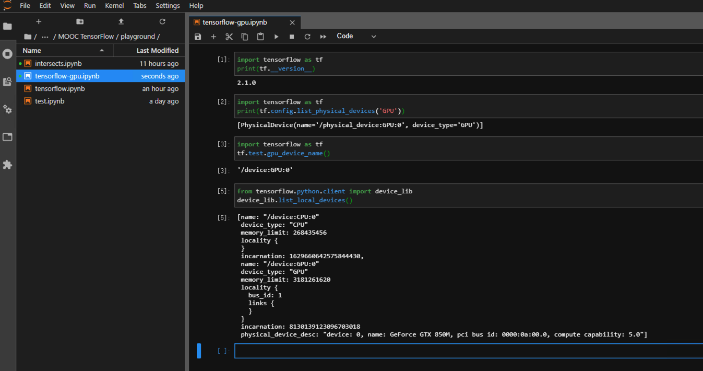


打印出来了可用于计算的设备有 CPU 与GPU，并分别打印出它们的信息及 GPU 计算能力，安装成功之后，接下来就可以跑代码训练神经元网络了。


### 4.3 一个简单的神经网络测试

最后来跑一跑常见的一个入门 Hellow World DEMO，根据一个简单的公式和构建一个神经网络，简单预测房屋的价格。

```python
import tensorflow as tf
import numpy as np
from tensorflow import keras

model = tf.keras.Sequential([keras.layers.Dense(units=1, input_shape=[1])])
model.compile(optimizer='sgd', loss='mean_squared_error')
xs = np.array([1.0, 2.0, 3.0, 4.0, 5.0, 6.0], dtype=float)
ys = np.array([5.0, 6.5, 8.0, 9.5, 11.0, 12.5], dtype=float)
model.fit(xs, ys, epochs=1000)
print(model.predict([7.0]))
```

假如房子的定价很简单，如果一个带卧室的房子是 15 万 + 35 万，也就是一间带主卧的房子 50 万，两间卧室的房子 65 万，注此类推。

输入 6 条数据，预测 7 间卧室的房子多少钱，这里把单位缩小，方便神经元网络对数据的处理，输入数据 1 代表一个带卧室的房子，输出 5，表示 50 万。


训练 1000 次，预测运行结果部分截图如下。

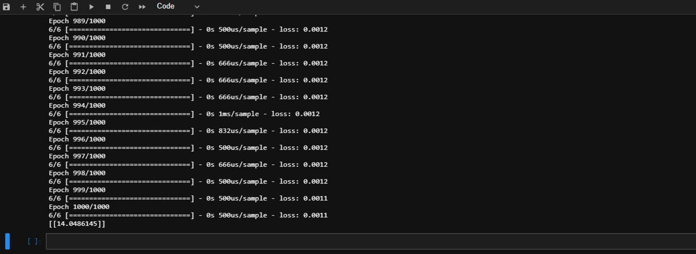


### 参考链接

- [TensorFlow 安装 GPU 支持](https://tensorflow.google.cn/install/gpu?hl=zh_cn)
- [安装 Tensorflow 2.1.0 版本](https://www.pythonf.cn/read/84187)

